# Autor
**Nombre:** Lucas Hernández Abreu\
**Email:** alu0101317496@ull.edu.es

## Practica:
💡 **Ejercicio1: Crear una escena con un plano, una esfera y un cubo.**

- [x]  **a)** Ninguno de los objetos será físico.

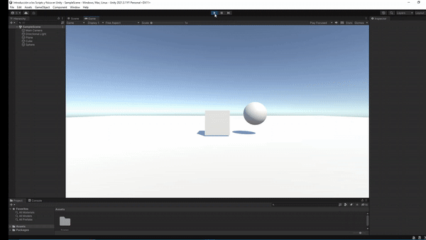

- [x]  **b)** La esfera tiene físicas, el cubo no.

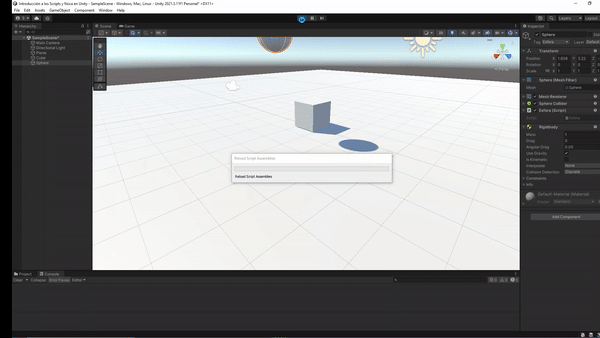

- [x]  **c)** La esfera y el cubo tienen físicas

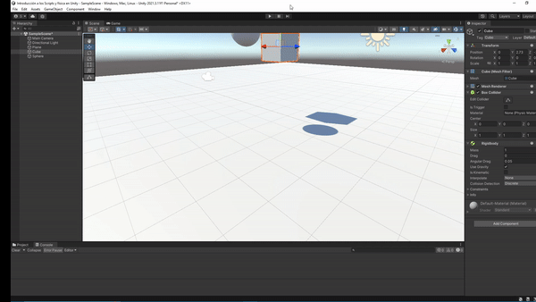

- [x]  **d)** La esfera y el cubo son físicos y la esfera tiene 10 veces la masa del cubo

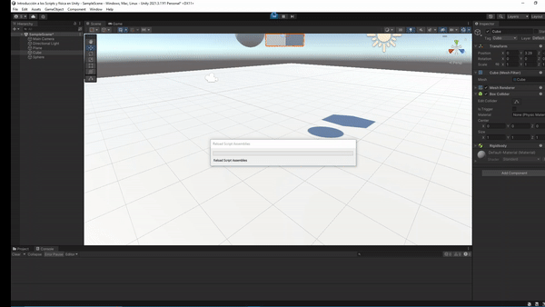

- [x]  **e)** La esfera tiene físicas y el cubo es de tipo IsTrigger

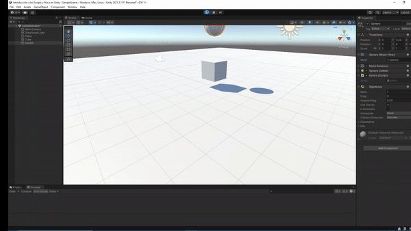

- [x]  **f)** La esfera tiene físicas, es cubo es de tipo IsTrigger y tiene físicas

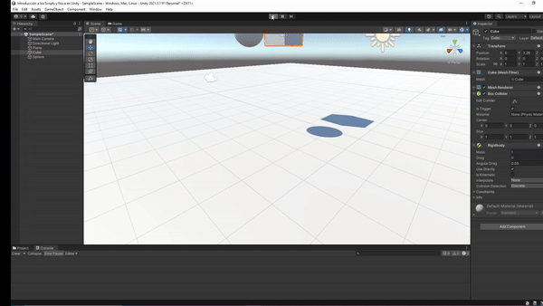

- [x]  **g)** La esfera y el cubo son físicos y la esfera tiene 10 veces la masa del cubo, se impide la rotación del cubo sobre el plano XZ.

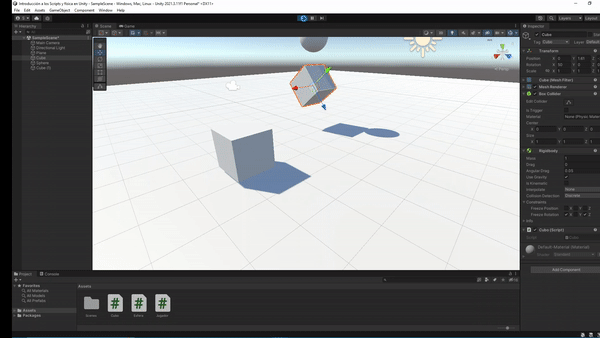
---
💡 **Ejercicio2: Crea un cubo que será el personaje que vas a mover.
Implementar el CharacterController.**

- [x]  **a)** Crear un script para el personaje que lo desplace sin simulación física.

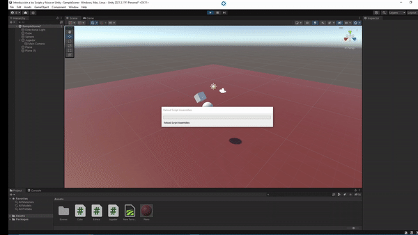

- [x]  **b)** Agregar un campo público que permita graduar la velocidad del movimiento.

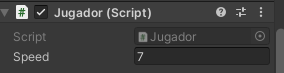

- [x]  **c)** Estar a la escucha de si el usuario a utilizado los ejes virtuales. Elegir cuáles se va a permitir utilizar: flechas, asdw

----
💡 **Ejercicio 3: Añadir los scripts necesarios para las siguientes opciones.**

- [x]  **a)** Se deben incluir varios cilindros sobre la escena. Cada vez que el objeto jugador colisione con alguno de ellos, deben aumentar su tamaño y el jugador aumentar puntuación.

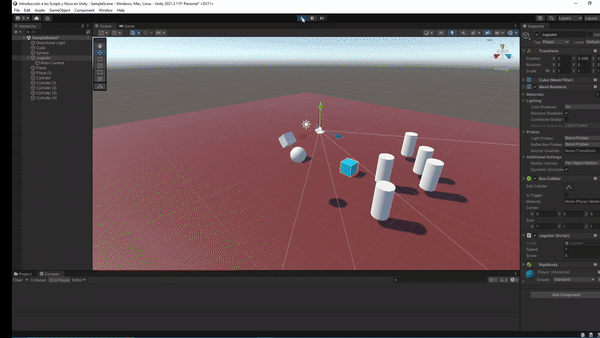

- [x]  **b)** Agregar cilindros de tipo A, en los que además, si el jugador pulsa la barra espaciadora lo mueve hacia fuera de él.

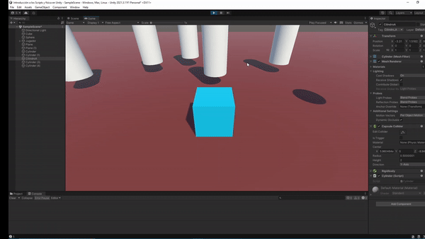

- [x]  **c)** Se deben incluir cilindros que se alejen del jugador cuando esté próximo.

- [x]  **d)** Ubicar un tercer objeto que sea capaz de detectar colisiones y que se mueva con las teclas: I, L, J, M.

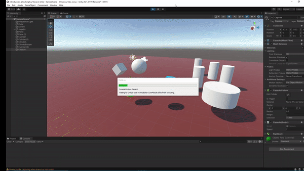

- [x]  **e)** Debes ubicar cubos que aumentan de tamaño cuando se le acerca una esfera y que disminuye cuando se le acerca el jugador.

